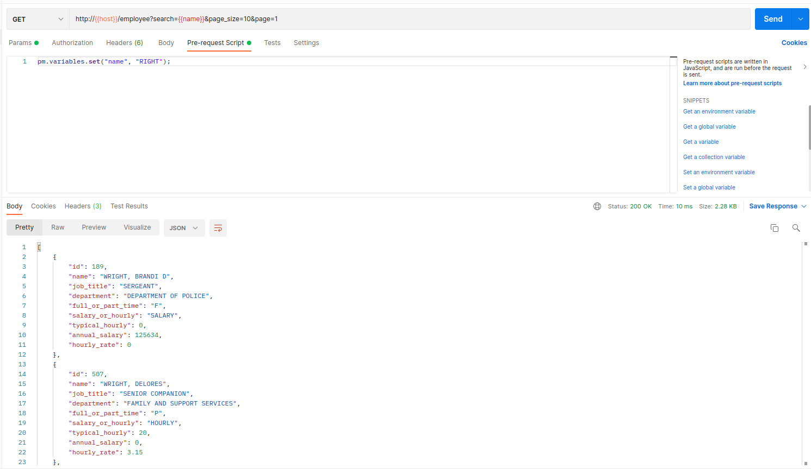
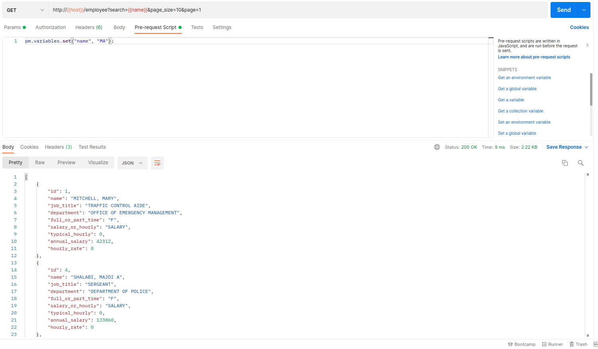
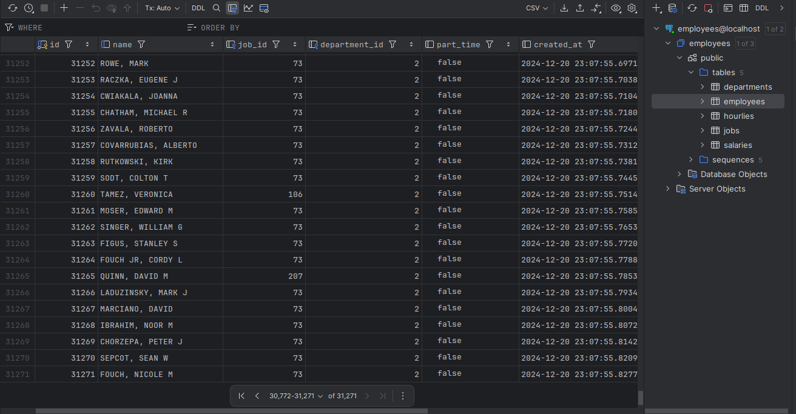
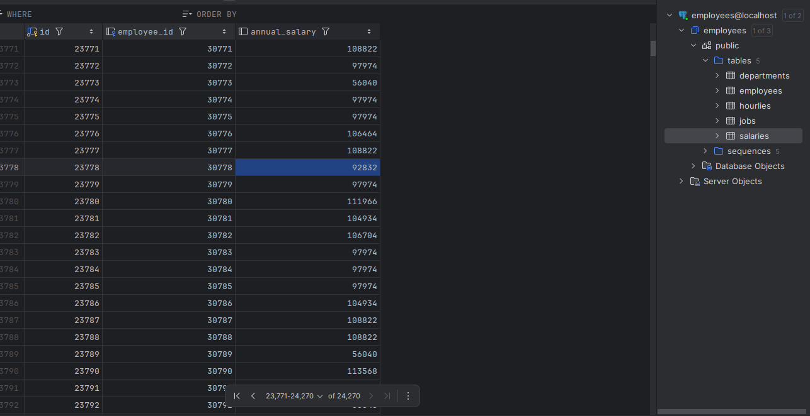
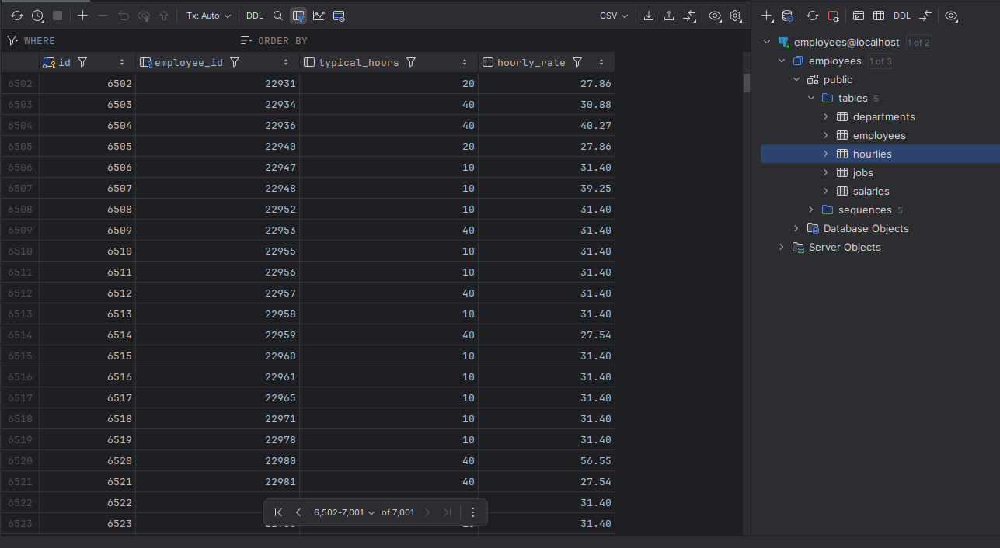

## Стек:  
#### Go, Gin (framework), Gorm (ORM), PostgreSQL, Docker

## API
API для поиска сотрудников по имени.
Метод возвращает полную информацию о сотрудниках с указанным именем.  
**Формат запроса:** `GET http://{{host}}/employee?search={{search}}&page_size={{page_size}}&page={{page_number}}`  
**Результат:** список сотрудников, у которых в именем есть совпадения с *{{search}}*

## Import command
Также реализованы команды для импорта сотрудников:

#### Проверка незавершённых импортов сотрудников
**Формат команды:** `./cli check`
**Результат:** выводит список всех незавершённых импортов с информацией по прогрессу каждого импорта

#### Возобновление импорта сотрудников
**Формат команды:** `./cli recover {{import_id}}`
**Результат:** возобновляет импорт сотрудников из файла с того места, где импорт был прерван и в случае успеха
выводит `Successfully imported CSV data`

#### Импорт сотрудников из csv файла
**Формат команды:** `./cli create-all {{csv_file_path}}`
**Результат:** имортирует всех сотрудников из файла и в случае успеха
выводит `Successfully imported CSV data`

**Примечание:** Команда используется только для создания новых сотрудников.

