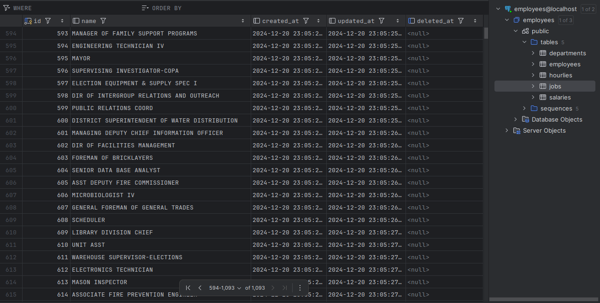

## API
API для поиска сотрудников по имени.
Метод возвращает полную информацию о сотрудниках с указанным именем.  
**Формат запроса:** `GET http://{{host}}/employee/{{name}}`  
**Результат:** список сотрудников с именем *{{name}}*

## Import command
Также реализована команда для импорта сотрудников из csv файла  
**Формат команды:** `go run main.go loadcsv {{путь к файлу}}`
**Результат:** имортирует всех сотрудников из файла и в случае успеха
выводит `Data loaded successfully!`

**Примечание:** В данной реализации система допускает сотрудников с одинаковым ФИО и не учитывает возможное дублирование сотрудников.
В виду того, что во входных данных есть сотрудники с одинаковыми ФИО,
но разными отделами, должностями и т.д. и в теории у сотрудника эти данные могут изменяться,
так что проблематично без дополнительной информации однозначно идентифицировать сотрудника по имени

